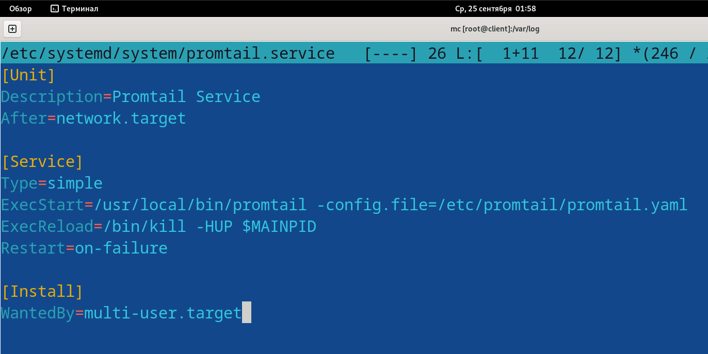
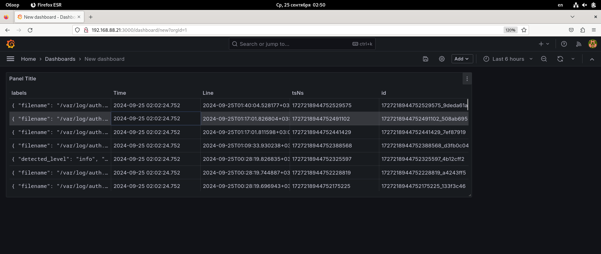

# Практика 1
## Беляев Степан Константинович
## ББМО-02-23

2 ВМ c ОС Debian 12, server и client

## rsyslog

Проверяем работу установленного rsyslog

Настраиваем на работу по udp по порту 514

Прописываем правила

### Настройка клиента

- Редактируем конфиг (/etc/rsyslog.d/all.conf - для всех логов)
  

### Логи на сервере

Смотрим директорию /var/log\
Директория client содержит логи с другой ВМ\
Проверяем  /var/log/client\

## LOKI

Устанавливаем пакеты git и wget\
Устанавливаем go\

Добавляем путь в /etc/profile/

Проверяем go

 tcp и порт 3100

Получаем loki, запускаем для проверки\
Проверяем в браузере метрики

Cоздаём пользователя и прописываем права

Создаём файл /etc/systemd/system/loki.service\
Заполняем необходимой инорфмацией

Добавляем в автозапуск и включаем

Проверяем 

### Настройка promtail

Устанавливаем promtail, прописываем правила, запускаем

Проверяем 

B браузере

Настраиваем порт 9080 tcp,\
редактируем promtail.yaml

Перезапускаем, открываем бразуер

### Снова сервер

Скачиваем grafana\
Устанавливаем\

Настраиваем порт 3000

Проверяем

Открываем браузер

Новый источник данных

Нажимаем сохранить

Создаём новый DashBoard\
Выбираем добавленные данные\
выборка по filename и файл auth.log

Нажимаем Run query, выбираем таблицу

Получаем наш DashBoard на главной странице

___
___
## elastic
___

___
## Выполнил Беляев Степан Константинович
## ББМО-02-23
___
___
___
